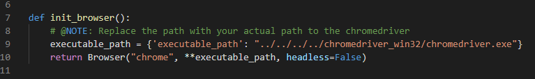

## web-scraping-challenge
# Mission to Mars

## Overview

The purpose of thie challenge is to, by the click of a button on a webpage, scrape various pieces of information about Mars from several websites and then display the results in that original webpage. This was done using several tools and technologies including *Pandas, Jupyter Notebook, BeautifulSoup, Splinter, MongoDB, and Flask* to name a few. Time to get scraping!

### Files and Folders

* [Landing Page](Missions_to_Mars/templates/index.html) - this *index.html* file is the landing page for the website and where the results of the scraping will be displayed
* **Jupyter Notebook** (Missions_to_Mars/mission_to_mars.jpynb) - the Jupyter Notebook file that was used to create the PyMongo script for the scraping; this is not used in the actual scraping process
* [Missions_to_Mars](Missions_to_Mars/) - main folder that holds all the files used and created for this project
    * [static](Missions_to_Mars/static/) - this folder holds two subfolders--css and images
        * [css](Missions_to_Mars/static/css/) - this folder holds the *style.css* file that helps format the webpage
        * [images](Missions_to_Mars/static/images/) - this folder holds the image file used as the background of the jumbotron on the webpage (*pia22594.jpg*) as well as the screenshots of the webpage
           #### Screenshot Files
            1. [Entire Webpage](Missions_to_Mars/static/images/entire_webpage.PNG) - screenshot of the entire populated webpage
            2. [Featured Mars Image and the Mars Facts table](Missions_to_Mars/static/images/featured_mars_image_and_mars_facts_table.PNG) - screenshot of the Featured Mars Image and the Mars Facts table
            3. [Four Hemispheres](Missions_to_Mars/static/images/four_hemispheres.PNG) - screenshot of the 4 hemispheres of Mars
            4. [Scrape Button](Missions_to_Mars/static/images/jumbotron_with_scrape_button.PNG) - screenshot of the jumbotron section of the webpage featuring the *Scrape New Data* button that kicks of the scraping
            5. [Latest News](Missions_to_Mars/static/images/latest_news.PNG) - screenshot of the *Latest News* section of the webpage
    * [templates](Missions_to_Mars/templates/) - this folder contains the *index.html* file, or the *Landing Page* file
    * [app.py](Missions_to_Mars/app.py) - this is the *Flask* API
    * [scrape_mars.py](Missions_to_Mars/scrape_mars.py) - this is the *PyMongo* script that does the scraping

    * [mars_facts_table](Missions_to_Mars/mars_facts_table.html) - this file is the Mars Facts table created in *Jupyter Notebook* and saved as an HTML file. This is not needed to run this project. It's more of a troubleshooting file when I had issues trying to get the Mars Facts table to display on the website. This information is also saved to a variable and that's how it's used when running this project.

## Requirements

1. *MongoDB* **must** be running. If it's installed locally, you need to run `mongod` from a terminal and leave that up and running in the background. Then open another terminal and run `mongo`. If you have *MongoDB* running as a service, you just need to open a terminal and run `mongo`.

2. For *Splinter* to work, you need to have the correct version of the *Chromedriver* downloaded and accessible. This must be the version that matches your current version of Chrome. Instructions on how to find your current version of *Chrome* as well as how/where to install the *Chromedriver* can be found at the end of this file in the **How-To Install Chromedriver** section, or [here](#how-to).

3. After the *Chromedriver* has been installed, you will need to modify the `executable_path` in the *scrape_mars.py* file to point to where you put the *chromedriver.exe* file.
    

4. If you run the *Jupyter Notebook*, you will also need to modify the `executable_path` in there as well. There are 2 cells that will need to be updated (one in the *JPL Mars Space Images - Feature Image* section and one in the *Mars Hemispheres* section).

Once the requirements are set, run `python app.py` from a Python terminal in the same folder as that file, click the URL to launch the webpage, and then click the *Scrape New Data* button to start scraping.

## Development and Analysis

I started with the *Jupyter Notebook* so I could begin scripting my scrapes and to figure out how to navigate to the information I was looking for. The first data I needed was from the [NASA Mars News Site](https://mars.nasa.gov/news/). I used *BeautifulSoup* to examine the HTML and search for the feature data and tags. Once that was found, I was able to extract the title and paragraph of the featured article to variables. 

The *JPL Mars Space Image* data found [here](https://www.jpl.nasa.gov/spaceimages/?search=&category=Mars) was a bit more involved. I had to navigate the website, click some buttons and search for the particular tags. This required using *Splinter* to navigate the site and *BeautifulSoup* to find the correct tags. It was a little extra tricky because we needed the fullsize image and not the medium sized one which was easier to get to. Once that was found, assigned that to a variable as well. The image only had a relative path, though, so had to concatenate the main site URL with the relative path to get the full URL.

Next I had to get *Mars Facts information* from [here](https://space-facts.com/mars/). This was data in a table on the webpage. So used *Pandas* to read the HTML into a dataframe. The information I needed was in the first table so extracted that, renamed columns, made the *Description* column the index, and then saved the dataframe to HTML as both a variable and as a file called *mars_facts_table.html*. This HTML file was actually not used as part of the scraping, only the variable version was used, but I used it later for troubleshooting the rendering issue I had in the *index.html* page.

The last scrape involved getting the 4 hemisphere images of Mars and their titles. This information came from the *USGS Astrogeology* site [here](https://astrogeology.usgs.gov/search/results?q=hemisphere+enhanced&k1=target&v1=Mars). This, like the JPL site, required using both *BeautifulSoup* and *Splinter*. This one required getting a list of relative paths first and concatenating those to the main site's URL to get the full image URLs. Then had to loop through those to get the title for each and create a list of dictionaries--each dictionary had the title and full URL for a particular Mars hemisphere.

With all the scraping determined, time to create the *PyMongo* file and the *Flask* API. For the *scrape_mars.py* file, that was mainly just copying the code used in *Jupyter Notebook* and pasting it into the file. Did not include the analyzing parts, though, since that wasn't needed anymore. I did add in some wait times when getting to the web pages so they would have time to fully load before attempting the scrape. The *USGS Astrogeology* site took the longest to load. After each site was scraped, the variables were added to a dictionary so that at the end, all the variables were stored in one dictionary and returned to the *app.py* file to save into a *MongoDB* database.

Set up two routes in the *app.py* file--one for the *Home* page and the other that runs the scraping. The scraping route then redirects to the *Home* page once the scraping process is finished so it can display the results on the HTML page.

The last part was creating the webpage. I used *Bootstrap* for the layout and *Jinja* for adding the data from the *MongoDB* database.

## Notes

Saved the screenshots of my site to the *Missions_to_Mars\static\images* folder. There's also the Jumbotron background image file I used (*pia22594.jpg*) saved in that same folder.

Had a few issues along the way with this one. Had trouble figuring out how to get the 4 hemispheres data pulled correctly. Ended up working through this with Erin Hislope because she was stuck at the same spot. We ended up working with each other on and off for the rest of this project as well which was great because as issues came up for one or the other of us, it was two sets of eyes on it to decipher what was wrong.

I got to use the Jumbotron element in my webpage this time around. Didn't get a chance to try that out with our last project. With all the great images of Mars from all the websites we were scraping, I really wanted to set the background of my Jumbotron to one of those and I was actually able to figure it out. Got some help from [here](https://jsfiddle.net/bootstrapious/f7ewb3pg/). Got the image from the *JPL NASA* website.

I also tried out cards in the webpage for the 4 hemispheres. Seemed like a good fit for that and I hadn't used them before. So I pulled out the code I had working and replaced it with the cards which I ended up liking better thankfully.

Ran into several issues with the webpage, though. First, I couldn't get the *Mars Facts* table to render. It just kept showing the HTML instead. I viewed the HTML that had been output from *pandas* and it showed the whole table, it just wouldn't work. Thought I needed to add it to a `table` element but after viewing the output, saw that the `table` element tags were actually part of that. Then tried sticking it in `div` tags but with no luck. Thankfully, Troy Ramsey offered up the automatic escaping found in *Jinja*. So I did some quick research on that and found the solution.

Another issue was with my *style.css* file. For whatever reason, only parts of that seemed to work with my *index.html* file. Finally started adding formatting directly in the *index.html* file to get it mostly how I wanted. Still wanted to format the *Mars Facts* table a bit. After rebooting my computer, some of the styles from the stylesheet actually started working and it broke other things. So I'm still not sure what is going on with that. Tried inspecting it with *Google's Inspect* but to no avail.

## How-To

To install the *Chromedriver*, first you need to find which version of *Chrome* you're using. 

1. In Chrome, click the Menu icon, 3-dot icon, in the upper right corner of the screen.
2. Click **Help** from the dropdown menu.
3. Click **About Google Chrome** from the next dropdown menu.
4. You should now be on the *Settings* window. Your version of *Chrome* should be listed under *Google Chrome*

### macOS

* The easiest way to install ChromeDriver on a Mac is through Homebrew. You can verify your installation by running `brew -v` in terminal. If you get an error instead of a version number, visit the Homebrew website [https://brew.sh/](https://brew.sh/) to install Homebrew, and then run the command.

* If Homebrew is installed, simply run `brew cask install chromedriver` from the terminal.

* Verify your installation by running `chromedriver --version`.

* If you run into permission issues after installing chromedriver, you can grant permission by going to: `System Preferences → Security and Privacy → General → Allow Anyway`.

### Windows

* Visit the ChromeDriver [webpage](https://sites.google.com/a/chromium.org/chromedriver/downloads). Note that ChromeDriver updates really often. Make sure to match your download to the version of *Chrome* you’re currently using. Otherwise, you’ll likely run into an error. Follow these steps:

1. Click on the file that matches your version of Chrome.

2. Click `chromedriver_win32.zip` to download ChromeDriver for Windows.

3. Extract the executable program file.

4. Place the file in the same folder as your Python web scraping script.
